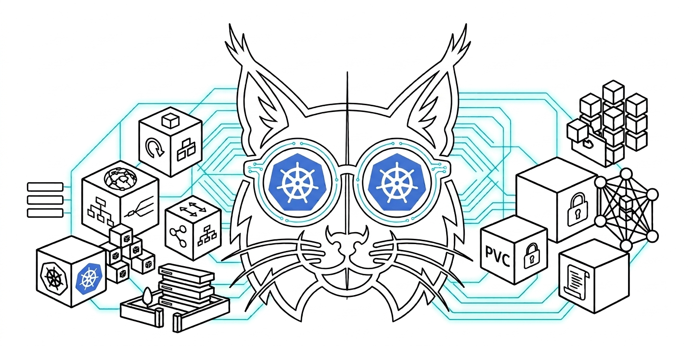

# 🔬 KubeLynx

See deeper into your Kubernetes clusters.

KubeLynx is an interactive Kubernetes diagnostics and troubleshooting CLI for inspecting cluster health, workloads, events, networking, and common operational issues.

[](https://github.com/ielyaakouby/kubelynx/actions/workflows/ci.yml)
[](https://github.com/ielyaakouby/kubelynx/releases/latest)
[](LICENSE)

<p align="center">
  
</p>

## Why KubeLynx

KubeLynx provides an interactive terminal interface for common Kubernetes diagnostics, inspections, monitoring, and recovery operations without requiring you to memorize long `kubectl` sequences.

It is a companion to `kubectl`, not a replacement. Destructive and administrative actions are limited by the Kubernetes RBAC of the current identity.

## Features

- **Interactive navigation** — `fzf` menus for namespaces, workloads, and actions
- **Kubernetes inspection** — describe, YAML, logs, events, and resource listings
- **Diagnostics** — a multi-step pod troubleshooting pipeline for common failure states
- **Monitoring** — pod usage, node allocation, and live status views
- **Workload operations** — scale, restart, rollback, exec, and copy
- **Networking** — port-forward, ingress inspection, and connectivity helpers
- **AI-assisted analysis** — optional Gemini, Ollama, or OpenAI diagnosis of unhealthy pods
- **Security utilities** — Secret/ConfigMap key viewers and a repository secret scan helper

## Requirements

**Runtime (required)**

- Bash
- `kubectl`
- `fzf`
- `jq`

**Runtime (optional)**

- `curl` — connectivity checks and cloud AI providers
- `gnome-terminal` — open selected actions in a new window (the rest of KubeLynx works without it)

**Installation / update (optional, depending on method)**

- `git` — clone-based install and git updates
- `curl` and `tar` — GitHub Release install and release-based updates

Linux is the supported platform. macOS is best-effort only.

## Installation

Installation is user-space and does not require `sudo`. The default locations are:

- Application: `${XDG_DATA_HOME:-$HOME/.local/share}/kubelynx`
- Executable: `${HOME}/.local/bin/kubelynx`

If a previous Kubediag install is found under the old paths, `install.sh` migrates the application directory and replaces the `kubediag` command with `kubelynx`. It does not keep a compatibility CLI.

If `~/.local/bin` is not on `PATH`, the installer prints how to add it. It does not edit `.bashrc` or other shell rc files.

### GitHub Release (preferred)

1. Download `kubelynx-vX.Y.Z.tar.gz` and `SHA256SUMS` from the [latest release](https://github.com/ielyaakouby/kubelynx/releases/latest).
2. Verify the archive:

   ```bash
   sha256sum -c SHA256SUMS
   ```

3. Extract and install:

   ```bash
   tar -xzf kubelynx-vX.Y.Z.tar.gz
   cd kubelynx-vX.Y.Z
   ./installer/install.sh
   ```

### Clone from source (development)

```bash
git clone https://github.com/ielyaakouby/kubelynx.git
cd kubelynx
./installer/install.sh
```

To symlink the clone instead of copying it into the XDG data directory:

```bash
./installer/install.sh --dev
```

### Run without installing

```bash
chmod +x bin/kubelynx.sh
./bin/kubelynx.sh
```

## Quick Start

```bash
kubelynx
```

## Usage

```bash
kubelynx              # interactive menu
kubelynx --help
kubelynx --version    # prints: KubeLynx vX.Y.Z
```

Library mode loads functions without opening the menu or requiring cluster access:

```bash
./bin/kubelynx.sh ok
```

You can also source the entrypoint in the current shell:

```bash
source ./bin/kubelynx.sh
kubelynx::load_modules
```

## Diagnostics

The pod diagnostics flow inspects status, logs, owners, events, node health, probes, and related networking. Typical states it is used with include `CrashLoopBackOff`, `ImagePullBackOff`, `OOMKilled`, `Pending`, `Error`, `Evicted`, `ContainerCreating`, and `Terminating`.

## AI Analysis

AI analysis is **optional**. When a pod is unhealthy, KubeLynx can send logs and events to one configured provider. Selection order:

| Priority | Provider | Configuration | Default model |
| :------: | -------- | ------------- | ------------- |
| 1 | Google Gemini | `GEMINI_API_KEY` | `gemini-2.5-flash` |
| 2 | Ollama (local) | auto-detect `OLLAMA_HOST` | `llama3.1` |
| 3 | OpenAI | `OPENAI_API_KEY` | `gpt-4o-mini` |

```bash
export GEMINI_API_KEY="..."
export GEMINI_MODEL="gemini-2.5-flash"

export OPENAI_API_KEY="..."
export OPENAI_MODEL="gpt-4o-mini"

export OLLAMA_HOST="http://localhost:11434"
export OLLAMA_MODEL="llama3.1"
```

Never put real API keys in shell history examples, issues, or commits.

KubeLynx does not intentionally include Kubernetes Secret objects in AI prompts. Log lines and events can still contain credentials. Data is transmitted to the selected external provider (except local Ollama). See [SECURITY.md](SECURITY.md).

## Configuration

| Variable | Description | Default |
| -------- | ----------- | ------- |
| `KUBECONFIG` | Kubernetes config path | kubectl default (`~/.kube/config`) |
| `TMPDIR` | Temporary files directory | `/tmp` |
| `GEMINI_API_KEY` | Google Gemini API key | unset |
| `GEMINI_MODEL` | Gemini model name | `gemini-2.5-flash` |
| `OPENAI_API_KEY` | OpenAI API key | unset |
| `OPENAI_MODEL` | OpenAI model name | `gpt-4o-mini` |
| `OLLAMA_HOST` | Ollama server URL | `http://localhost:11434` |
| `OLLAMA_MODEL` | Ollama model name | `llama3.1` |
| `KUBELYNX_INSTALL_DIR` | Override install directory | `${XDG_DATA_HOME:-$HOME/.local/share}/kubelynx` |
| `KUBELYNX_BIN_DIR` | Override executable directory | `${HOME}/.local/bin` |
| `KUBELYNX_KUBECONFIG_DIR` | Directory of kubeconfig files for the switch helper | `${HOME}/.kube` |

Temporary files are created with `mktemp` and removed when that KubeLynx process exits.

## Kubernetes Access

KubeLynx uses the current `kubectl` context and `KUBECONFIG`. It does not add permissions beyond that identity. Scale, delete, exec, and similar actions succeed or fail according to Kubernetes RBAC.

## Security

See [SECURITY.md](SECURITY.md) for vulnerability reporting and AI data-flow notes.

- Do not commit API keys or kubeconfig files.
- Do not paste Secret values, tokens, or kubeconfig contents into GitHub issues.
- `gnome-terminal` is optional; Secret/log viewers fall back to the current terminal when it is missing.

## Updating

```bash
./installer/update.sh
```

- Git / `--dev` installs: `git pull` on the tracked clone.
- Release installs: download the latest GitHub Release archive. Updates do not switch a release user onto unreleased `main`.

## Uninstall

```bash
./installer/uninstall.sh
```

The uninstaller removes the KubeLynx symlink and the KubeLynx install directory only. It is idempotent and refuses unsafe paths.

## Development

```bash
make check
```

See [CONTRIBUTING.md](CONTRIBUTING.md). Maintainer release steps are in [docs/RELEASING.md](docs/RELEASING.md).

## Project Structure

```
.
├── bin/kubelynx.sh          # CLI entrypoint
├── config/defaults.sh       # overridable defaults
├── installer/               # install, update, uninstall, checks
├── src/k8s/                 # sourced modules
│   ├── actions/
│   ├── common/
│   ├── core/
│   ├── helpers/
│   ├── menu/
│   ├── monitoring/
│   ├── selectors/
│   ├── tools/
│   └── troubleshoot/
├── tests/                   # cluster-free smoke tests
├── scripts/                 # packaging and maintainer helpers
└── VERSION                  # single source of truth for the version
```

## Contributing

See [CONTRIBUTING.md](CONTRIBUTING.md) and the [Code of Conduct](CODE_OF_CONDUCT.md).

## Releases

Versions are `MAJOR.MINOR.PATCH`. Maintainers tag `vMAJOR.MINOR.PATCH` on `main`. GitHub Actions then validates `VERSION`, runs `make check`, and publishes the GitHub Release. See [docs/RELEASING.md](docs/RELEASING.md).

Verify downloaded archives:

```bash
sha256sum -c SHA256SUMS
```

## License

[Apache License 2.0](LICENSE)

## Author

[Ismail Elyaakouby](https://github.com/ielyaakouby)
